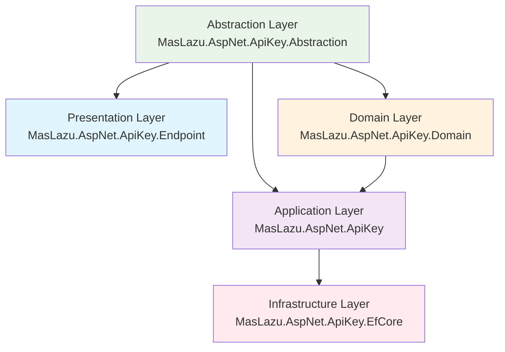
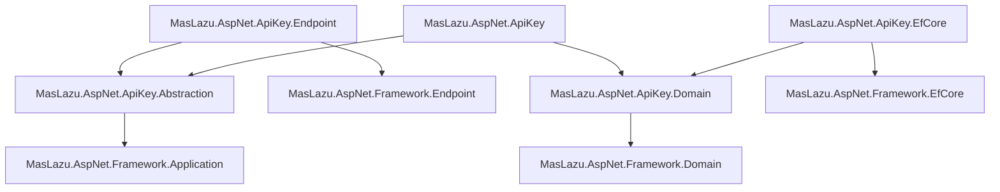

# MasLazu.AspNet.ApiKey

A comprehensive ASP.NET Core library for secure API key management, built with Clean Architecture principles.

## Overview

This solution provides a complete implementation for managing API keys in ASP.NET Core applications. It includes secure key generation, validation, rotation, permission scopes, and full CRUD operations with a clean, layered architecture.

## Architecture

The solution follows Clean Architecture principles with clear separation of concerns:



## Projects

### Core Projects

- **MasLazu.AspNet.ApiKey.Abstraction**: Defines interfaces, DTOs, and contracts for API key management
- **MasLazu.AspNet.ApiKey.Domain**: Contains domain entities and business rules
- **MasLazu.AspNet.ApiKey**: Service layer implementing the abstraction interfaces
- **MasLazu.AspNet.ApiKey.EfCore**: Entity Framework Core implementation for data persistence
- **MasLazu.AspNet.ApiKey.Endpoint**: ASP.NET Core API endpoints using FastEndpoints

### Testing

- **MasLazu.AspNet.ApiKey.Test**: Comprehensive unit tests for all services

## Key Features

### 🔐 Security

- Secure API key generation using GUIDs
- Key validation with expiration and revocation checks
- Permission-based access control through scopes
- Key rotation for enhanced security

### 🏗️ Architecture

- Clean Architecture with clear layer separation
- Dependency injection throughout
- Interface-based design for testability
- Async/await support with cancellation tokens

### 📊 Data Management

- Full CRUD operations for API keys and scopes
- Entity Framework Core integration
- Efficient database queries with proper indexing
- Audit trail with creation and update timestamps

### ✅ Validation

- FluentValidation for request validation
- Business rule enforcement
- Type-safe operations with nullable reference types

### 🧪 Testing

- Comprehensive unit test coverage
- Mock-based testing with Moq
- xUnit test framework
- High test coverage validation

## Dependencies

The solution depends on several MasLazu framework packages:



## Getting Started

### Prerequisites

- .NET 9.0 SDK
- Entity Framework Core compatible database (SQL Server, PostgreSQL, etc.)

### Installation

1. Clone the repository
2. Restore packages:

   ```bash
   dotnet restore
   ```

3. Run tests:
   ```bash
   dotnet test
   ```

### Usage

#### Service Registration

```csharp
// Register API key services
builder.Services.AddApiKeyApplicationServices();

// Register EF Core DbContext
builder.Services.AddDbContext<ApiKeyDbContext>(options =>
    options.UseSqlServer(connectionString));

// Register endpoints (if using Endpoint project)
builder.Services.AddFastEndpoints();
```

#### Basic Operations

```csharp
// Inject services
private readonly IApiKeyService _apiKeyService;

// Create API key
var request = new CreateApiKeyRequest(userId, "My API Key", DateTime.UtcNow.AddDays(30));
var apiKey = await _apiKeyService.CreateAsync(userId, request);

// Validate API key
var isValid = await _apiKeyService.ValidateAsync(new ValidateApiKeyRequest("api-key", permissionId));

// Rotate API key
var rotatedKey = await _apiKeyService.RotateAsync(userId, apiKey.Id);
```

## API Endpoints

The Endpoint project provides RESTful APIs for:

### API Keys

- `POST /apikeys` - Create API key
- `GET /apikeys` - List API keys (paginated)
- `GET /apikeys/{id}` - Get API key by ID
- `PUT /apikeys/{id}` - Update API key
- `DELETE /apikeys/{id}` - Delete API key
- `POST /apikeys/{id}/revoke` - Revoke API key
- `POST /apikeys/{id}/rotate` - Rotate API key
- `POST /apikeys/validate` - Validate API key

### API Key Scopes

- `POST /apikeys/scopes` - Add scope
- `GET /apikeys/scopes` - List scopes (paginated)
- `GET /apikeys/scopes/{id}` - Get scope by ID
- `PUT /apikeys/scopes/{id}` - Update scope
- `DELETE /apikeys/scopes/{id}` - Delete scope

## Configuration

### Database Migration

```bash
# Add migration
dotnet ef migrations add InitialCreate --project src/MasLazu.AspNet.ApiKey.EfCore

# Update database
dotnet ef database update --project src/MasLazu.AspNet.ApiKey.EfCore
```

### Appsettings.json

```json
{
  "ConnectionStrings": {
    "ApiKeyDb": "Server=.;Database=ApiKeyDb;Trusted_Connection=True;"
  }
}
```

## Testing

Run the test suite:

```bash
dotnet test test/MasLazu.AspNet.ApiKey.Test/
```

## Contributing

1. Fork the repository
2. Create a feature branch
3. Make your changes
4. Add tests
5. Submit a pull request

## License

This project is licensed under the MIT License - see the LICENSE file for details.

## Support

For questions or issues, please open an issue on GitHub.
