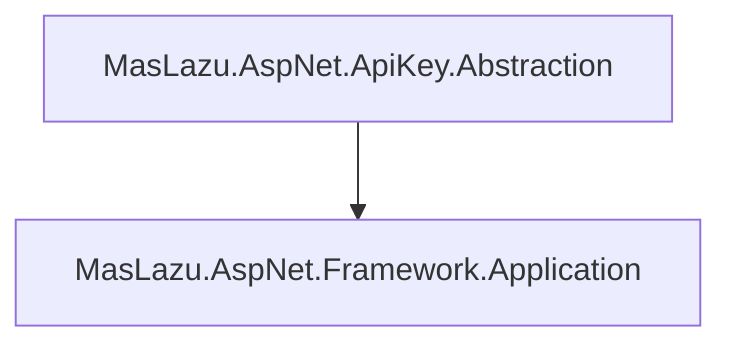

# MasLazu.AspNet.ApiKey.Abstraction

A clean abstraction layer for API key management, providing contracts and data models for secure API key lifecycle management.

## Overview

This project defines the core interfaces and data transfer objects for API key management functionality. It serves as the foundation for implementing API key services in ASP.NET Core applications.

## Features

- ✅ **API Key Management**: Complete CRUD operations for API keys
- ✅ **Permission Scopes**: Granular permission management through scopes
- ✅ **Key Rotation**: Secure key regeneration capabilities
- ✅ **Validation**: Built-in API key validation with permission checking
- ✅ **Audit Trail**: Tracking of key usage and lifecycle events
- ✅ **Type Safety**: Strongly-typed models with nullable reference types

## Core Interfaces

### IApiKeyService

Primary interface for API key management operations:

```csharp
public interface IApiKeyService : ICrudService<ApiKeyDto, CreateApiKeyRequest, UpdateApiKeyRequest>
{
    Task RevokeAsync(Guid userId, Guid apiKeyId, CancellationToken cancellationToken = default);
    Task<ApiKeyDto> RotateAsync(Guid userId, Guid apiKeyId, CancellationToken cancellationToken = default);
    Task<bool> ValidateAsync(ValidateApiKeyRequest request, CancellationToken cancellationToken = default);
    Task RevokeAllForUserAsync(Guid userId, CancellationToken cancellationToken = default);
    Task UpdateLastUsedAsync(Guid userId, Guid apiKeyId, CancellationToken cancellationToken = default);
    Task<IEnumerable<ApiKeyDto>> GetByUserIdAsync(Guid userId, CancellationToken cancellationToken = default);
}
```

### IApiKeyScopeService

Interface for managing permission scopes:

```csharp
public interface IApiKeyScopeService : ICrudService<ApiKeyScopeDto, CreateApiKeyScopeRequest, UpdateApiKeyScopeRequest>
{
    Task<ApiKeyScopeDto> AddScopeAsync(Guid userId, ApiKeyScopeRequest request, CancellationToken cancellationToken = default);
    Task RemoveScopeAsync(Guid userId, ApiKeyScopeRequest request, CancellationToken cancellationToken = default);
}
```

## Data Models

### ApiKeyDto

Complete representation of an API key:

```csharp
public record ApiKeyDto(
    Guid Id,
    Guid UserId,
    string Key,
    string? Name,
    DateTimeOffset? ExpiresDate,
    DateTimeOffset? LastUsed,
    DateTimeOffset? RevokedDate,
    DateTimeOffset CreatedAt,
    DateTimeOffset? UpdatedAt
) : BaseDto(Id, CreatedAt, UpdatedAt);
```

### ApiKeyScopeDto

Represents a permission scope for an API key:

```csharp
public record ApiKeyScopeDto(
    Guid Id,
    Guid ApiKeyId,
    Guid PermissionId,
    DateTimeOffset CreatedAt,
    DateTimeOffset? UpdatedAt
) : BaseDto(Id, CreatedAt, UpdatedAt);
```

## Request Models

### CreateApiKeyRequest

```csharp
public record CreateApiKeyRequest(
    Guid UserId,
    string? Name,
    DateTime? ExpiresDate
);
```

### UpdateApiKeyRequest

```csharp
public record UpdateApiKeyRequest(
    Guid Id,
    string? Name,
    DateTime? ExpiresDate,
    DateTime? RevokedDate
) : BaseUpdateRequest(Id);
```

### ValidateApiKeyRequest

```csharp
public record ValidateApiKeyRequest(
    string Key,
    Guid? PermissionId
);
```

## Dependencies

- **.NET 9.0**
- **MasLazu.AspNet.Framework.Application** (1.0.0-preview.6)

## Dependencies Diagram



## Usage

### Service Registration

```csharp
builder.Services.AddScoped<IApiKeyService, ApiKeyService>();
builder.Services.AddScoped<IApiKeyScopeService, ApiKeyScopeService>();
```

### Basic Operations

```csharp
// Create API key
var request = new CreateApiKeyRequest(userId, "My API Key", DateTime.UtcNow.AddDays(30));
var apiKey = await apiKeyService.CreateAsync(userId, request);

// Validate API key
var isValid = await apiKeyService.ValidateAsync(new ValidateApiKeyRequest("api-key", permissionId));

// Rotate API key
var rotatedKey = await apiKeyService.RotateAsync(userId, apiKey.Id);
```

## Project Structure

```
MasLazu.AspNet.ApiKey.Abstraction/
├── Interfaces/
│   ├── IApiKeyService.cs
│   └── IApiKeyScopeService.cs
├── Models/
│   ├── ApiKeyDto.cs
│   ├── ApiKeyScopeDto.cs
│   ├── CreateApiKeyRequest.cs
│   ├── CreateApiKeyScopeRequest.cs
│   ├── UpdateApiKeyRequest.cs
│   ├── UpdateApiKeyScopeRequest.cs
│   ├── ApiKeyScopeRequest.cs
│   └── ValidateApiKeyRequest.cs
└── MasLazu.AspNet.ApiKey.Abstraction.csproj
```

## Key Methods

### API Key Operations

- `CreateAsync()` - Create new API key
- `GetByIdAsync()` - Retrieve API key by ID
- `UpdateAsync()` - Update API key properties
- `DeleteAsync()` - Delete API key
- `RevokeAsync()` - Revoke API key
- `RotateAsync()` - Generate new key value
- `ValidateAsync()` - Validate key and permissions
- `RevokeAllForUserAsync()` - Revoke all keys for user
- `GetByUserIdAsync()` - Get all keys for user

### Scope Operations

- `CreateAsync()` - Create new scope
- `GetByIdAsync()` - Retrieve scope by ID
- `UpdateAsync()` - Update scope properties
- `DeleteAsync()` - Delete scope
- `AddScopeAsync()` - Add permission to API key
- `RemoveScopeAsync()` - Remove permission from API key

## Design Principles

- **Interface Segregation**: Focused, single-responsibility interfaces
- **Dependency Inversion**: Abstractions over concretions
- **Type Safety**: Strong typing with nullable reference types
- **Async Support**: Full async/await with cancellation tokens
- **Clean Contracts**: Well-defined method signatures and return types
