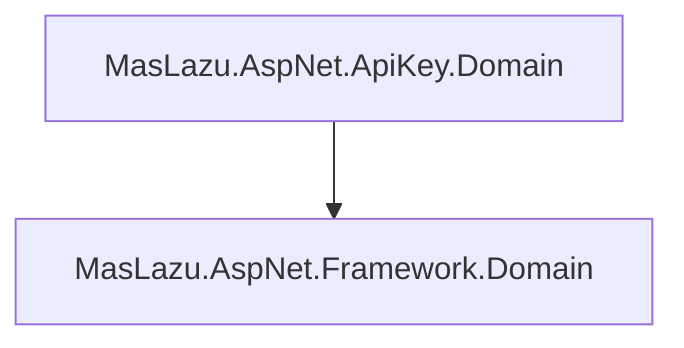

# MasLazu.AspNet.ApiKey.Domain

Domain layer containing the core business entities for API key management.

## Overview

This project defines the domain entities that represent the core business concepts of API key management. It contains the fundamental building blocks that model the business domain.

## Domain Entities

### ApiKey

Represents an API key entity with all its properties and relationships:

```csharp
public class ApiKey : BaseEntity
{
    public Guid UserId { get; set; }
    public string Key { get; set; } = string.Empty;
    public string? Name { get; set; }
    public DateTime? ExpiresDate { get; set; }
    public DateTime? LastUsed { get; set; }
    public DateTime? RevokedDate { get; set; }

    public ICollection<ApiKeyScope> Scopes { get; set; } = [];
}
```

**Properties:**

- `UserId`: The user who owns this API key
- `Key`: The actual API key value (string)
- `Name`: Optional human-readable name for the key
- `ExpiresDate`: Optional expiration date
- `LastUsed`: Timestamp of last usage
- `RevokedDate`: Timestamp when key was revoked
- `Scopes`: Navigation property to related permission scopes

### ApiKeyScope

Represents a permission scope associated with an API key:

```csharp
public class ApiKeyScope : BaseEntity
{
    public Guid ApiKeyId { get; set; }
    public Guid PermissionId { get; set; }

    public ApiKey? ApiKey { get; set; }
}
```

**Properties:**

- `ApiKeyId`: Reference to the parent API key
- `PermissionId`: Reference to the permission this scope grants
- `ApiKey`: Navigation property back to the API key

## Dependencies

- **.NET 9.0**
- **MasLazu.AspNet.Framework.Domain** (1.0.0-preview.6)

## Dependencies Diagram



## Base Entity

Both entities inherit from `BaseEntity` which provides:

- `Id`: Unique identifier (Guid)
- `CreatedAt`: Creation timestamp
- `UpdatedAt`: Last update timestamp

## Relationships

```
ApiKey (1) ──── (Many) ApiKeyScope
   │                    │
   └─ UserId            └─ PermissionId
```

- **One-to-Many**: One API key can have multiple permission scopes
- **Many-to-One**: Multiple scopes can reference the same permission

## Business Rules

### ApiKey Rules

- Each API key belongs to exactly one user
- API key values must be unique
- Keys can have optional expiration dates
- Revoked keys cannot be used for authentication
- Keys track their last usage for monitoring

### ApiKeyScope Rules

- Each scope links one API key to one permission
- Scopes are used for fine-grained access control
- Multiple scopes can reference the same permission
- Scopes inherit the lifecycle of their parent API key

## Usage

Domain entities are used by:

- **Repository Layer**: For data persistence operations
- **Service Layer**: For business logic implementation
- **Mapping Layer**: For converting to/from DTOs

## Project Structure

```
MasLazu.AspNet.ApiKey.Domain/
├── Entities/
│   ├── ApiKey.cs
│   └── ApiKeyScope.cs
└── MasLazu.AspNet.ApiKey.Domain.csproj
```

## Design Principles

- **Rich Domain Model**: Entities contain business logic and validation
- **Entity Relationships**: Proper navigation properties for data access
- **Type Safety**: Strong typing with nullable reference types
- **Clean Architecture**: Domain entities are independent of infrastructure concerns
- **Business Focus**: Entities model real business concepts, not database tables
