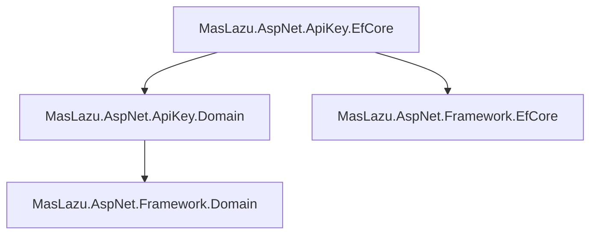

# MasLazu.AspNet.ApiKey.EfCore

This project provides the Entity Framework Core implementation for the API key management system.

## Purpose

The EfCore layer contains the database context, entity configurations, and data access setup for persisting API key and scope entities using Entity Framework Core. This layer serves as the infrastructure for the `MasLazu.AspNet.ApiKey` service, providing data persistence capabilities.

## Key Components

- **ApiKeyDbContext**: The main database context inheriting from BaseDbContext, defining DbSets for ApiKey and ApiKeyScope entities.

- **Configurations**: Entity type configurations for ApiKey and ApiKeyScope, including keys, relationships, and indexes.

- **Extensions**: Service collection extensions for registering EF Core services (currently a placeholder).

## Dependencies

- Microsoft.EntityFrameworkCore (9.0.9)
- MasLazu.AspNet.Framework.EfCore (1.0.0-preview.6)
- MasLazu.AspNet.ApiKey.Domain (project reference)

## Dependencies Diagram

## Target Framework

.NET 9.0 with implicit usings and nullable reference types enabled.
