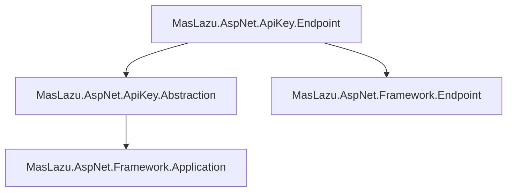

# MasLazu.AspNet.ApiKey.Endpoint

This project provides the ASP.NET Core API endpoints for the API key management system.

## Purpose

The Endpoint layer contains the HTTP API endpoints implemented using FastEndpoints, exposing CRUD operations and business logic for managing API keys and scopes.

## Key Components

- **EndpointGroups**: Groups endpoints for ApiKeys and ApiKeyScopes under versioned routes.

- **Endpoints**:

  - **ApiKeys**: Create, Delete, GetById, GetPaginated, GetUserApiKeys, Revoke, RevokeAllUser, Rotate, Update, Use, Validate
  - **ApiKeyScopes**: Add, Create, Delete, GetById, GetPaginated, Remove, Update

- **Extensions**: Service collection extensions (currently empty).

## Dependencies

- FastEndpoints (7.0.1)
- MasLazu.AspNet.Framework.Endpoint (1.0.0-preview.6)
- MasLazu.AspNet.ApiKey.Abstraction (project reference)

## Dependencies Diagram

## Target Framework

.NET 9.0 with implicit usings and nullable reference types enabled.
