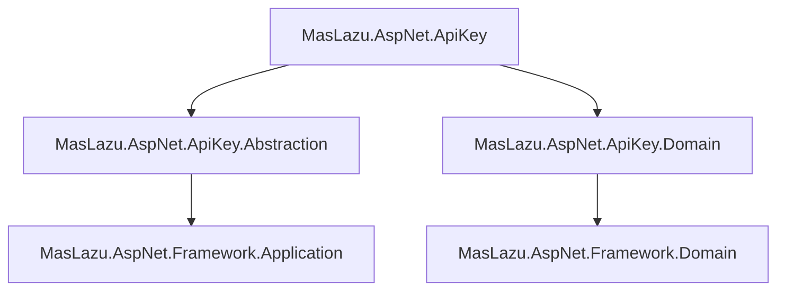

# MasLazu.AspNet.ApiKey

Core service layer implementing the API key management interfaces defined in `MasLazu.AspNet.ApiKey.Abstraction`.

## Overview

This project contains the concrete implementations of the API key management services defined in the abstraction layer. It provides the business logic for managing API keys and their associated permission scopes, implementing the contracts specified in `MasLazu.AspNet.ApiKey.Abstraction`.

## Architecture Relationship

This service layer implements the interfaces defined in `MasLazu.AspNet.ApiKey.Abstraction`:

- `ApiKeyService` implements `IApiKeyService`
- `ApiKeyScopeService` implements `IApiKeyScopeService`

The services inherit from `CrudService<T, TDto, TCreate, TUpdate>` to provide standard CRUD operations while implementing custom business logic for API key management.

## Core Services

### ApiKeyService

Main service implementing `IApiKeyService` for comprehensive API key management:

```csharp
public class ApiKeyService : CrudService<Domain.Entities.ApiKey, ApiKeyDto, CreateApiKeyRequest, UpdateApiKeyRequest>, IApiKeyService
```

**Key Methods:**

- `RevokeAsync()`: Revoke an API key by setting RevokedDate
- `RotateAsync()`: Generate new key value while preserving the key record
- `ValidateAsync()`: Validate key with permission checking
- `RevokeAllForUserAsync()`: Bulk revoke all keys for a user
- `UpdateLastUsedAsync()`: Track key usage for monitoring
- `GetByUserIdAsync()`: Retrieve all keys for a specific user

### ApiKeyScopeService

Service for managing permission scopes associated with API keys:

```csharp
public class ApiKeyScopeService : CrudService<ApiKeyScope, ApiKeyScopeDto, CreateApiKeyScopeRequest, UpdateApiKeyScopeRequest>, IApiKeyScopeService
```

**Key Methods:**

- `AddScopeAsync()`: Grant a permission to an API key
- `RemoveScopeAsync()`: Revoke a permission from an API key

## Business Logic Implementation

### Key Rotation

```csharp
public async Task<ApiKeyDto> RotateAsync(Guid userId, Guid apiKeyId, CancellationToken ct = default)
{
    Domain.Entities.ApiKey? apiKey = await Repository.GetByIdAsync(apiKeyId, ct) ??
        throw new NotFoundException("API key not found.");

    apiKey.Key = Guid.NewGuid().ToString("N");
    await Repository.UpdateAsync(apiKey, ct);
    await UnitOfWork.SaveChangesAsync(ct);
    return apiKey.Adapt<ApiKeyDto>();
}
```

### Key Validation

```csharp
public async Task<bool> ValidateAsync(ValidateApiKeyRequest request, CancellationToken ct = default)
{
    return await ReadRepository.ExistsAsync(x =>
        x.Key == request.Key &&
        x.RevokedDate == null &&
        (x.ExpiresDate == null || x.ExpiresDate > DateTime.UtcNow) &&
        x.Scopes.Any(s => s.PermissionId == request.PermissionId), ct);
}
```

## Extensions

### Service Registration

```csharp
public static class ApiKeyApplicationServiceExtension
{
    public static IServiceCollection AddApiKeyApplicationServices(this IServiceCollection services)
    {
        services.AddScoped<IApiKeyService, ApiKeyService>();
        services.AddScoped<IApiKeyScopeService, ApiKeyScopeService>();

        return services;
    }
}
```

## Validators

Request validation using FluentValidation:

### CreateApiKeyRequestValidator

```csharp
public class CreateApiKeyRequestValidator : AbstractValidator<CreateApiKeyRequest>
{
    public CreateApiKeyRequestValidator()
    {
        RuleFor(x => x.UserId).NotEmpty();
        RuleFor(x => x.Name).MaximumLength(100).When(x => !string.IsNullOrEmpty(x.Name));
        RuleFor(x => x.ExpiresDate).GreaterThan(DateTime.UtcNow)
            .When(x => x.ExpiresDate.HasValue)
            .WithMessage("Expiration date must be in the future.");
    }
}
```

## Property Maps

Entity property mapping for dynamic queries:

### ApiKeyEntityPropertyMap

```csharp
public class ApiKeyEntityPropertyMap : IEntityPropertyMap<Domain.Entities.ApiKey>
{
    private readonly Dictionary<string, Expression<Func<Domain.Entities.ApiKey, object>>> _map = new()
    {
        { "id", ak => ak.Id },
        { "userId", ak => ak.UserId },
        { "key", ak => ak.Key },
        { "name", ak => ak.Name! },
        { "expiresDate", ak => ak.ExpiresDate! },
        { "lastUsed", ak => ak.LastUsed! },
        { "revokedDate", ak => ak.RevokedDate! },
        { "createdAt", ak => ak.CreatedAt },
        { "updatedAt", ak => ak.UpdatedAt! }
    };
}
```

## Dependencies

- **.NET 9.0**
- **Microsoft.Extensions.DependencyInjection** (9.0.9)
- **MasLazu.AspNet.ApiKey.Abstraction** (implements interfaces from this project)
- **MasLazu.AspNet.ApiKey.Domain** (uses domain entities from this project)

## Dependencies Diagram



## Key Features

### Security

- Secure key generation using `Guid.NewGuid().ToString("N")`
- Key validation with expiration and revocation checks
- Permission-based access control through scopes

### Error Handling

- `NotFoundException` for missing entities
- Proper exception messages for debugging
- Graceful handling of edge cases

### Performance

- Async/await throughout for non-blocking operations
- Efficient database queries with proper indexing
- Cancellation token support for request cancellation

### Maintainability

- Clean separation of concerns
- Dependency injection for testability
- FluentValidation for request validation
- Mapster for object mapping

## Project Structure

```
MasLazu.AspNet.ApiKey/
├── Services/
│   ├── ApiKeyService.cs
│   └── ApiKeyScopeService.cs
├── Extensions/
│   ├── ApiKeyApplicationExtension.cs
│   ├── ApiKeyApplicationServiceExtension.cs
│   ├── ApiKeyApplicationUtilExtension.cs
│   └── ApiKeyApplicationValidatorExtension.cs
├── Utils/
│   ├── ApiKeyEntityPropertyMap.cs
│   └── ApiKeyScopeEntityPropertyMap.cs
├── Validators/
│   ├── CreateApiKeyRequestValidator.cs
│   ├── CreateApiKeyScopeRequestValidator.cs
│   ├── UpdateApiKeyRequestValidator.cs
│   └── UpdateApiKeyScopeRequestValidator.cs
└── MasLazu.AspNet.ApiKey.csproj
```

## Usage

### Service Registration

```csharp
builder.Services.AddApiKeyApplicationServices();
```

### Using Services

```csharp
// Inject services
private readonly IApiKeyService _apiKeyService;
private readonly IApiKeyScopeService _apiKeyScopeService;

// Create API key
var createRequest = new CreateApiKeyRequest(userId, "My API Key", DateTime.UtcNow.AddDays(30));
var apiKey = await _apiKeyService.CreateAsync(userId, createRequest);

// Validate API key
var isValid = await _apiKeyService.ValidateAsync(new ValidateApiKeyRequest("key", permissionId));

// Rotate API key
var rotatedKey = await _apiKeyService.RotateAsync(userId, apiKey.Id);
```

## Design Principles

- **SOLID**: Single responsibility, open/closed, dependency inversion
- **Clean Architecture**: Business logic independent of infrastructure
- **Dependency Injection**: Constructor injection for testability
- **Async Programming**: Non-blocking operations with cancellation support
- **Validation**: Input validation with meaningful error messages
